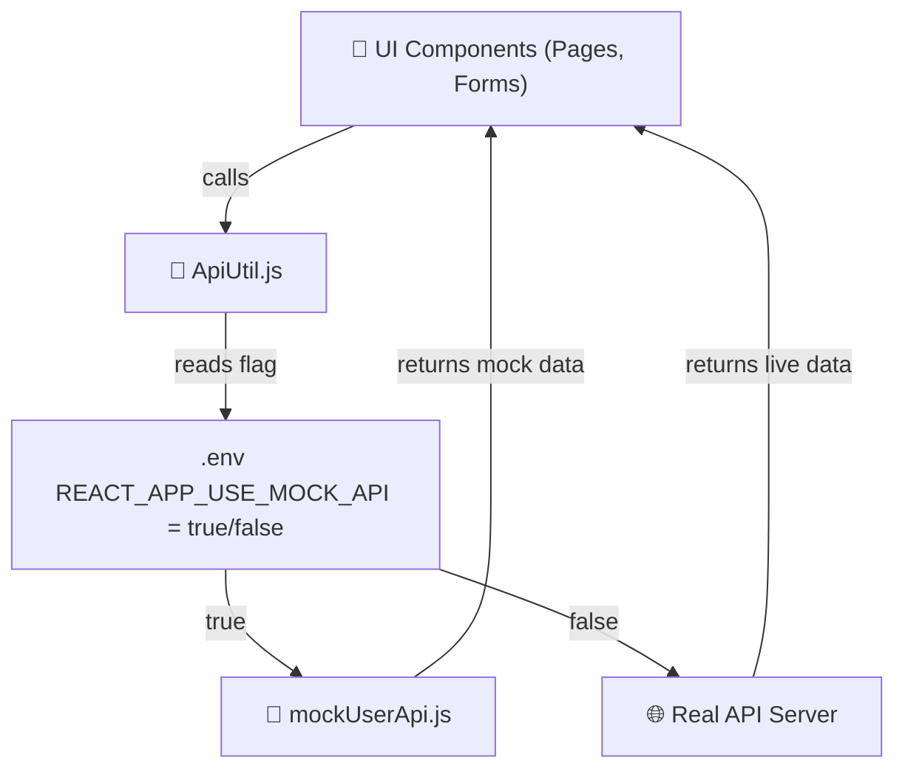

# ⚙️ API Architecture Flow



### Updated Explanation

1. **UI Components**: Pages and forms in the `src/pages` folder interact with the API through `ApiUtil.js`.
2. **ApiUtil.js**: Located in `src/components/api`, this utility handles API calls and determines whether to use mock APIs or real APIs based on the `.env` configuration.
3. **MockToggle**: The `.env` file contains the `REACT_APP_USE_MOCK_API` flag to toggle between mock and real APIs.
4. **Mock APIs**: Mock implementations are located in `src/mockData/user/mockUserApi.js`.
5. **Real APIs**: If the mock flag is disabled, the application interacts with the real API server.
6. **Error Handling**: The `callApi` function in `ApiUtil.js` includes error handling to manage API failures gracefully.
```
